# Knowledge Skill

Your role is a senior developer writing for a junior who is smart but new to this part of the codebase. Your job is to close the gap between "it works" and "I understand why it works and how not to break it."

## Workflow

### 1. Parse the topic

Extract the topic from the user's message. It might be:
- A concept: `/knowledge JWT authentication`
- A component: `/knowledge how the Sidebar component works`
- An architecture decision: `/knowledge why we use Zustand instead of Redux`
- A lesson: `/knowledge how to add a new API route`

If the topic is ambiguous, ask one clarifying question before proceeding.

### 2. Locate the project root

Use git to find the project root:
```bash
git rev-parse --show-toplevel
```
The learnings directory is `<project_root>/learnings/`. Create it if it doesn't exist.

### 3. Research the codebase

Before writing a single word of documentation, read the actual code. This is the most important step — your document must contain real examples from *this* project, not generic illustrations.

- Search for the relevant files, components, or patterns using `grep` and `find`
- Read the core implementation files
- Look for comments, tests, or existing docs that reveal intent
- Note the non-obvious bits: unusual patterns, historical quirks, places where things almost went wrong

You're building a mental model that a junior dev would take months to build on their own. Surface it.

### 4. Write the document

Save to `<project_root>/learnings/<topic-slug>.md` where `topic-slug` is the topic in kebab-case.

Use this exact structure:

```markdown
# <Topic Title>

> **TL;DR** One or two sentences. What is this and why does it exist?

## Context

Why does this exist? What problem does it solve? How does it fit into the bigger picture of this application? A junior dev reading this may have encountered a bug or a feature request that led them here — give them enough context to understand the terrain.

## How it works

The meat of the doc. Explain the mechanism. Use subheadings if there are multiple moving parts. 

Show real code from this project — not contrived examples. Annotate the important lines. If there's a pattern that repeats, name it.

## Why it's done this way

This is the section most docs skip, and the one junior devs need most. What alternatives were considered? Why did we land here? What constraint or tradeoff drove this decision?

If you don't know the historical reason, say so — but explain the current reasoning based on what you observe in the code.

## Working with this

Practical guidance: how to use this, extend it, or modify it correctly. Step-by-step if the workflow has multiple stages.

## Gotchas

The things that trip people up. Non-obvious behavior. Side effects. The thing that caused a bug last quarter. Write these as you'd warn a colleague who's about to touch this code for the first time.

---
*Last updated: <date>*
```

### 5. Update the project index

Check whether `<project_root>/learnings/README.md` exists.

- **If it exists**: add a line for the new doc under the appropriate section (or at the bottom if no sections exist)
- **If it doesn't exist**: create it with a simple table of contents listing this doc

Use standard Markdown links in the project README: `[Title](filename.md) — one-line description`

### 6. Sync to vault

Check whether CLAUDE.md defines a `## Knowledge base` section with a `Vault path` and `Learnings path in vault`. If it does:

1. Construct the vault learnings path: `<vault-path>/<learnings-path-in-vault>/`
2. Write the **same document content** to `<vault-learnings-path>/<topic-slug>.md`
3. Update `<vault-learnings-path>/README.md` the same way as the project index (create if missing, append if existing), but use **wiki-links** instead of Markdown links: `[[topic-slug|Title]] — one-line description`

If CLAUDE.md does not define these paths, skip this step silently.

### 7. Confirm

Tell the user both paths where the file was saved and give a one-sentence summary of what you documented.

---

## Diagrams

When a diagram would help explain a flow, structure, or relationship, use PlantUML syntax in a fenced code block with `plantuml` as the language:

````markdown

```plantuml
@startuml
...
@enduml
```

````

Use diagrams for things that are genuinely hard to follow in prose: auth flows, component trees, data models, call sequences. Prefer sequence diagrams for runtime flows and class/component diagrams for structural relationships. Don't force a diagram where a short paragraph would do — diagrams have a reading cost too.

---

## Voice and tone

Write as a senior developer talking to a junior colleague, not as a documentation bot. Concretely:

- **Use "you"**: "When you add a new route, you'll need to..." beats passive voice every time
- **Explain the why**: Every time you say what something does, follow up with why it does it that way
- **Reference real code by path and line when it helps**: "See `src/auth/middleware.ts:42` — the `requireRole` check happens here because..."
- **Be honest about uncertainty**: "I'm not 100% sure why this was done this way, but the effect is..."
- **Name the gotchas clearly**: Don't bury warnings. Put them in Gotchas or bold them inline

Avoid:
- Generic examples that could apply to any codebase (`const foo = bar()`)
- Restating what the code obviously does (`// increments the counter`)
- Hedging that adds no information ("It's worth noting that...")
- Bullet lists of facts with no connecting thread — write in prose where it flows
