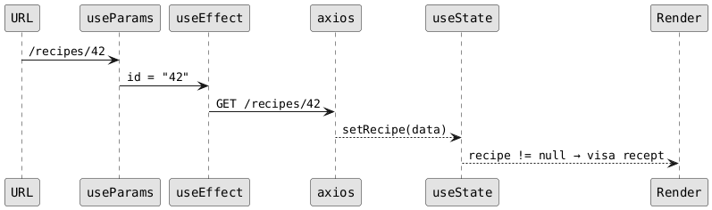

# React Hooks: useState, useEffect och useParams

> **TL;DR** `useState` lagrar data som får komponenten att rita om sig själv. `useEffect` kör kod som sida-effekter — t.ex. API-anrop. `useParams` läser URL-parametrar som `:id`. De används i kombination i nästan varje komponent i det här projektet.

## Context

React-komponenter är funktioner. Det speciella med dem är att React anropar dem igen varje gång något ändras — det kallas en *render*. Hooks är Reacts sätt att låta dig bevara data och köra kod *mellan* renders.

Utan hooks startar allt om från noll varje gång komponenten renderas. Med hooks kan du säga åt React: "kom ihåg det här värdet" (`useState`) eller "kör det här en gång när komponenten laddas" (`useEffect`).

---

## useState

### Vad det gör

`useState` ger dig en variabel som React håller koll på. När du uppdaterar den ritar React om komponenten automatiskt.

```tsx
const [recipes, setRecipes] = useState<Recipe[]>([]);
//     ^^^^^^^ nuvarande värde
//                ^^^^^^^^^ funktion för att uppdatera
//                                    ^^^^ startvärde
```

Du får alltid tillbaka ett par: det nuvarande värdet och en setter-funktion. `recipes` är vad du läser. `setRecipes(nyLista)` är hur du ändrar det.

### Hur det används i projektet

**RecipeList** — två separata state-värden, ett för datan och ett för laddningsstatus:

```tsx
// apps/recipes-frontend/src/app/recipes/RecipeList.tsx
const [recipes, setRecipes] = useState<Recipe[]>([]);
const [loading, setLoading] = useState(true);
```

Startvärdet för `recipes` är en tom array `[]` — komponenten renderar utan data direkt, sedan fyller API-svaret på den. `loading` börjar som `true` och sätts till `false` när anropet är klart (oavsett om det lyckades eller inte, tack vare `.finally()`).

**RecipeDetail** — ett enda state-värde som antingen är null eller ett recept:

```tsx
// apps/recipes-frontend/src/app/recipes/RecipeDetail.tsx
const [recipe, setRecipe] = useState<Recipe | null>(null);
```

`null` som startvärde är ett medvetet val: komponenten kan kolla `if (!recipe)` för att veta om datan har kommit än. Det är ett vanligt mönster för data som laddas asynkront.

**AuthContext** — state som lever högre upp i komponentträdet och delas med hela appen via context:

```tsx
// apps/recipes-frontend/src/app/auth/AuthContext.tsx
const [user, setUser] = useState<User | null>(null);
const [loading, setLoading] = useState(true);
```

Samma mönster som RecipeList, men här lagras den inloggade användaren. `null` betyder "inte inloggad".

### Grundregeln

Du måste alltid använda settern — aldrig mutera variabeln direkt. Det här fungerar **inte**:

```tsx
recipes.push(nyttRecept); // React ser inte förändringen
```

Det rätta sättet:

```tsx
setRecipes([...recipes, nyttRecept]); // ny array → React renderar om
```

---

## useEffect

### Vad det gör

`useEffect` kör kod efter att komponenten har renderats. Det är för saker som inte passar i renderingen själv — API-anrop, prenumerationer, timers.

```tsx
useEffect(() => {
  // körs efter render
}, [beroende1, beroende2]);
//  ^^^^^^^^^^^^^^^^^^^^^^^^^^
//  beroende-arrayen styr när detta körs
```

Beroende-arrayen är kritisk:
- **Tom `[]`** — körs bara en gång, när komponenten mountas (laddas in på sidan)
- **Med värden `[id]`** — körs varje gång `id` ändras
- **Ingen array alls** — körs efter varje render (sällan vad du vill)

### Hur det används i projektet

**RecipeList** hämtar alla recept en gång när komponenten laddas:

```tsx
// apps/recipes-frontend/src/app/recipes/RecipeList.tsx
useEffect(() => {
  axios
    .get<Recipe[]>(`${API_URL}/recipes`, { withCredentials: true })
    .then((r) => setRecipes(r.data))
    .finally(() => setLoading(false));
}, []); // tom array = körs bara vid mount
```

**RecipeDetail** hämtar ett specifikt recept och måste köra om om URL:ens `:id` ändras:

```tsx
// apps/recipes-frontend/src/app/recipes/RecipeDetail.tsx
useEffect(() => {
  axios
    .get<Recipe>(`${API_URL}/recipes/${id}`, { withCredentials: true })
    .then((r) => setRecipe(r.data));
}, [id]); // körs om när id ändras
```

`id` är med i beroende-arrayen för att om användaren navigerar direkt från `/recipes/1` till `/recipes/2` utan att komponenten avmountats ska rätt recept hämtas. Om du hade `[]` där istället skulle sidan sitta fast på receptet från första laddningen.

**AuthContext** kollar om användaren är inloggad direkt när appen startar:

```tsx
// apps/recipes-frontend/src/app/auth/AuthContext.tsx
useEffect(() => {
  axios
    .get<User>(`${API}/auth/me`, { withCredentials: true })
    .then((r) => setUser(r.data))
    .catch(() => setUser(null))      // inte inloggad = sätt till null
    .finally(() => setLoading(false));
}, []); // en gång vid mount
```

Det är det enda stället i projektet som har en `.catch()` — om `/auth/me` returnerar 401 vet vi att sessionen gått ut och sätter `user` till `null`.

### Sekvensen render → effect

Det är viktigt att förstå ordningen: React renderar komponenten *först*, sedan kör `useEffect`. Det betyder att komponenten alltid renderas med startvärdet *innan* API-svaret kommer.

```
1. useState initieras (recipes = [], loading = true)
2. Komponenten renderas → visar "Laddar recept..."
3. useEffect körs → skickar API-anrop
4. API svarar → setRecipes(...), setLoading(false)
5. React renderar om → visar receptlistan
```

Det är därför `loading`-kontrollen måste finnas *i* renderingen — inte i `useEffect`.

---

## useParams

### Vad det gör

`useParams` läser ut dynamiska delar av URL:en. Den fungerar bara i komponenter som renderas av en `<Route path="/nåt/:parameter">`.

### Hur det används i projektet

Route-definitionen i `app.tsx` deklarerar att `:id` är en dynamisk del av URL:en:

```tsx
// apps/recipes-frontend/src/app/app.tsx
<Route path="/recipes/:id" element={<RecipeDetail />} />
```

Inne i `RecipeDetail` plockas det ut:

```tsx
// apps/recipes-frontend/src/app/recipes/RecipeDetail.tsx
const { id } = useParams<{ id: string }>();
```

Typparametern `{ id: string }` talar om för TypeScript vilka parametrar som finns och vad de heter. Värdena är alltid strängar — URL:er är text. Komponenten konverterar inte `id` till ett nummer, utan skickar det direkt i URL-strängen till axios, och det fungerar eftersom backend tar emot det som en URL-parameter ändå.

### Koppling till useEffect

`useParams` och `useEffect` samverkar i `RecipeDetail`. `id` från URL:en är det värde som `useEffect` bevakar — om det ändras hämtas ett nytt recept:

```tsx
const { id } = useParams<{ id: string }>();
const [recipe, setRecipe] = useState<Recipe | null>(null);

useEffect(() => {
  axios.get<Recipe>(`${API_URL}/recipes/${id}`, ...).then((r) => setRecipe(r.data));
}, [id]); // id från useParams styr när hämtningen görs om
```

---

## Hur de tre hänger ihop

I `RecipeDetail` jobbar alla tre tillsammans:



1. **URL** innehåller `/recipes/42`
2. **`useParams`** extraherar `id = "42"`
3. **`useEffect`** ser att `id` finns i sin beroende-array och kör API-anropet
4. API-svaret → **`useState`**-settern uppdaterar `recipe`
5. React renderar om komponenten med det riktiga receptet

---

## Varför det är gjort så här

Det här är det klassiska "local state + useEffect för datahämtning"-mönstret. Det är det enklaste sättet att hämta data i React utan extra bibliotek.

Nästa steg i projektet är att migrera till **React Query** (nämnt i CLAUDE.md). React Query ersätter `useState`/`useEffect`-kombinationen med `useQuery`, som ger caching, laddnings- och feltillstånd ur lådan, och automatisk refetch. Mönstret du ser nu är en bra grund för att förstå vad React Query löser — det gör exakt samma sak, men mer robust.

---

## Arbeta med detta

**Lägga till ett nytt state-värde:** Alltid som en separat `useState`-rad. Luta dig inte mot att lägga allt i ett enda objekt om det inte hänger ihop naturligt — `loading` och `recipes` är separata saker.

**Lägga till ett nytt API-anrop:** Kopiera mönstret från `RecipeList` — axios i `useEffect`, `setX` i `.then()`, töm beroende-array om du bara vill hämta en gång.

**Testa komponenter med dessa hooks:** Testerna mockar axios (`jest.mock('axios')`) och kontrollerar vad `.get` returnerar. `useEffect` körs i testmiljön precis som i browsern — du behöver inte göra något speciellt. Se `RecipeList.spec.tsx` och `RecipeDetail.spec.tsx` för exempel.

---

## Gotchas

**`useState`-settern är asynkron.** Om du anropar `setRecipes(ny)` och sedan loggar `recipes` direkt efteråt ser du det gamla värdet. React uppdaterar state inför nästa render, inte omedelbart.

**Tom beroende-array `[]` ≠ "kör aldrig om".** Det betyder "kör bara vid mount". Om du glömmer ett beroende (t.ex. skriver `[]` istället för `[id]`) kör effekten aldrig om när `id` ändras — en klassisk bug.

**`useParams` ger alltid `string`, aldrig `number`.** URL:en `/recipes/42` ger `id = "42"`. Om du någonsin behöver ett riktigt heltal måste du konvertera: `parseInt(id, 10)` eller `Number(id)`.

**`useParams` returnerar `string | undefined`.** TypeScript vet inte om parametern faktiskt finns i URL:en vid kompileringstid. Om du använder `useParams<{ id: string }>()` säger du till TypeScript "lita på mig, den finns", men React Router kan returnera `undefined` om komponenten av misstag renderas utanför rätt `<Route>`. I det här projektet renderas `RecipeDetail` bara från rätt route, så det är okej.

**Effekter körs *efter* render, inte *under*.** Det är lätt att tro att `useEffect` blockerar rendering tills API-anropet är klart. Det gör det inte — komponenten renderar alltid med startvärdet först. Bygg aldrig logik som förutsätter att state är ifyllt vid första render.

---
*Last updated: 2026-05-19*
