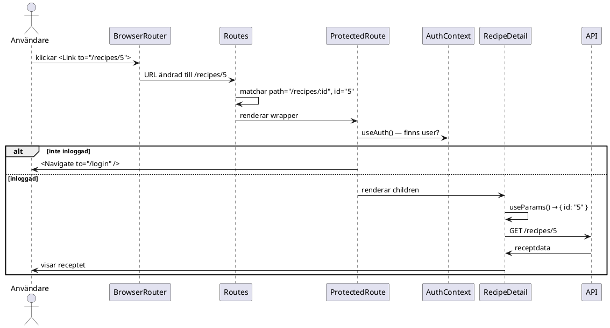

# Routing i React — hur det fungerar i den här appen

> **TL;DR** React Router låter appen byta "sida" utan att webbläsaren laddar om — URL:en ändras, men det är React som bestämmer vad som visas. Den här appen har tre routes och en autentiseringsspärr som skyddar alla sidor utom `/login`.

## Kontext

En traditionell webbapp laddar om hela sidan vid varje länkklick — webbläsaren skickar en ny HTTP-förfrågan och servern svarar med ny HTML. Det fungerar, men det är långsamt och tappar all lokal state (scrollposition, formulärdata, etc.).

React Router löser det annorlunda: appen laddas en gång, och när du klickar en länk uppdaterar React bara de delar av DOM:en som faktiskt ändras. URL:en i webbläsaren ändras (med History API), men ingen nätverksförfrågan görs för sidbytet i sig — bara eventuella datahämtningar som den nya sidan behöver.

## Hur det fungerar

### 1. Providern sätts upp i `main.tsx`

```tsx
// apps/recipes-frontend/src/main.tsx
root.render(
  <StrictMode>
    <BrowserRouter>
      <App />
    </BrowserRouter>
  </StrictMode>,
);
```

`BrowserRouter` är routerns "motor" — den lyssnar på URL-ändringar via webbläsarens History API och gör den nuvarande URL:en tillgänglig för alla komponenter i trädet. Utan den fungerar ingen av de andra Router-hooksen eller komponenterna. Den sätts ytterst, en gång, och påverkar hela appen.

### 2. Routes definieras i `app.tsx`

```tsx
// apps/recipes-frontend/src/app/app.tsx
<Routes>
  <Route path="/login" element={<LoginPage />} />
  <Route
    path="/recipes/:id"
    element={
      <ProtectedRoute>
        <RecipeDetail />
      </ProtectedRoute>
    }
  />
  <Route
    path="/*"
    element={
      <ProtectedRoute>
        <Home />
      </ProtectedRoute>
    }
  />
</Routes>
```

`Routes` tittar på den nuvarande URL:en och renderar den första `Route` vars `path` matchar. Ordningen spelar roll:

- `/login` — matchar exakt, ingen autentisering krävs
- `/recipes/:id` — matchar `/recipes/5`, `/recipes/42` osv. Kolon-prefixet (`:id`) är en *dynamisk parameter* — värdet efter `/recipes/` fångas och görs tillgängligt via `useParams`
- `/*` — jokertecknet matchar allt annat. Det är catch-all:en, alltså startsidan med receptlistan

### 3. `ProtectedRoute` skyddar autentiseringskrävande sidor

```tsx
// apps/recipes-frontend/src/app/auth/ProtectedRoute.tsx
export function ProtectedRoute({ children }: { children: React.ReactNode }) {
  const { user, loading } = useAuth();
  if (loading) return <p>Laddar...</p>;
  if (!user) return <Navigate to="/login" replace />;
  return <>{children}</>;
}
```

Det här är ett vanligt React-mönster: en komponent som wrappas runt andra och bestämmer om de får renderas. `ProtectedRoute` frågar `AuthContext` om det finns en inloggad användare. Om inte, renderas `<Navigate to="/login" replace />` istället för children — det är en omdirigering utan att lämna ett spår i historiken (`replace` innebär att "tillbaka"-knappen inte tar dig tillbaka till den skyddade sidan).

`loading`-checken är viktig: när appen startar vet den inte ännu om du är inloggad (det kräver ett nätverksanrop till `/auth/me`). Under den tiden returneras en laddningsindikator istälelt för att felaktigt skicka dig till `/login`.

### 4. Navigation med `Link`

```tsx
// apps/recipes-frontend/src/app/recipes/RecipeList.tsx
<Link to={`/recipes/${r.id}`}>{r.name}</Link>
```

`Link` renderar en vanlig `<a>`-tagg i DOM:en men *interceptar* klickhändelsen. Istället för att webbläsaren navigerar normalt anropar React Router History API och uppdaterar vilken Route som renderas. Resultatet: URL:en ändras, men sidan laddas inte om.

`RecipeDetail` har också en "tillbaka"-länk:
```tsx
<Link to="/" className="recipe-detail__back">← Tillbaka</Link>
```
Det tar dig till `/*`-routen (startsidan), inte bokstavligen `index.html`.

### 5. Läsa URL-parametrar med `useParams`

```tsx
// apps/recipes-frontend/src/app/recipes/RecipeDetail.tsx
const { id } = useParams<{ id: string }>();
```

`useParams` returnerar ett objekt med alla dynamiska parametrar från den matchade routen. Eftersom routen är definierad som `/recipes/:id` heter parametern `id`. Värdet är alltid en sträng — om du behöver ett nummer måste du konvertera det själv (`parseInt(id, 10)` eller liknande).

`id` används sedan direkt i API-anropet:
```tsx
axios.get<Recipe>(`${API_URL}/recipes/${id}`, { withCredentials: true })
```

### Hela flödet för `/recipes/5`



## Varför det är gjort så här

**`BrowserRouter` i `main.tsx` istället för i `App`** — routern behöver omsluta allt som använder routing, inklusive `App` själv. Om den låg inuti `App` skulle `App` inte kunna använda routing-hooks på toppnivå.

**`ProtectedRoute` som wrapper istälelt för logik inuti varje sida** — det håller autentiseringslogiken på ett ställe. Om du lägger till en ny skyddad sida wrappas den bara med `<ProtectedRoute>`, inget annat att komma ihåg.

**`/*` som catch-all för startsidan** — det matchar `/`, `/om-oss`, `/vad-som-helst`. I den här appen finns egentligen bara en "hem"-destination, men mönstret är flexibelt. Alternativet `path="/"` med `exact` finns i äldre React Router-versioner (v5), men i v6 är matching alltid exakt som standard — catch-all kräver explicit `/*`.

## Arbeta med routing

**Lägga till en ny skyddad sida:**
1. Skapa din komponent, t.ex. `ShoppingList.tsx`
2. Lägg till en route i `app.tsx`:
   ```tsx
   <Route
     path="/shopping"
     element={
       <ProtectedRoute>
         <ShoppingList />
       </ProtectedRoute>
     }
   />
   ```
3. Länka till den med `<Link to="/shopping">` var du vill

**Navigera programmatiskt** (utan ett klick på en länk):
```tsx
import { useNavigate } from 'react-router-dom';

const navigate = useNavigate();
navigate('/recipes/5');       // gå till detaljsida
navigate('/', { replace: true }); // gå hem, ersätt historiken
```

## Gotchas

**I tester: använd `MemoryRouter`, inte `BrowserRouter`.** `BrowserRouter` kräver ett riktigt webbläsar-History API, vilket inte finns i jsdom (testmiljön). `MemoryRouter` håller historiken i minnet istälelt.

```tsx
// rätt — fungerar i tester
render(<MemoryRouter><RecipeList /></MemoryRouter>);

// fel — kraschar eller ger konstiga fel i tester
render(<BrowserRouter><RecipeList /></BrowserRouter>);
```

Med `MemoryRouter` kan du också sätta startsida:
```tsx
<MemoryRouter initialEntries={['/recipes/42']}>
```

**`useParams` returnerar alltid strängar.** Routen är `:id` och id:t i databasen är ett heltal, men `useParams` ger dig `"42"` (sträng). I den här appen skickas värdet rakt in i URL-strängen för API-anropet, vilket fungerar. Om du däremot skulle jämföra det med ett nummer (`id === 42`) är det alltid falskt.

**`Navigate` med `replace` vs utan.** Utan `replace` läggs den nya URL:en på historikstacken — användaren kan trycka "tillbaka" och hamna på den skyddade sidan igen (och omdirigeras på nytt). Med `replace` ersätts nuvarande post i historiken, vilket ger ett renare beteende när man redirectar på grund av saknad autentisering.

**`AuthContext` måste vara ovanför `Routes` i trädet.** `ProtectedRoute` använder `useAuth()` som hämtar data från `AuthContext`. Om `AuthProvider` låg *inuti* en Route istälelt för runt `Routes` skulle de andra routerna inte ha tillgång till auth-state.

---
*Last updated: 2026-05-19*
