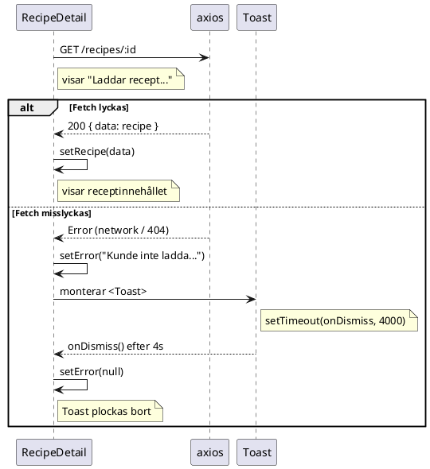

# Toast-komponenten

> **TL;DR** En toast är ett tillfälligt meddelande som visas en kort stund och sedan försvinner av sig självt. I det här projektet används den för att visa felmeddelanden utan att blockera användaren.

## Kontext

När `RecipeDetail` misslyckas med att hämta ett recept — för att backend är nere, nätverket strular eller URL:en innehåller ett ogiltigt id — hände tidigare ingenting. Användaren såg laddningstexten för evigt, utan att förstå varför.

En toast löser det här på ett icke-intrusivt sätt: den dyker upp, ger information, och försvinner sedan. Användaren behöver inte interagera med den.

## Hur det fungerar

### Komponenten själv

```tsx
// apps/recipes-frontend/src/app/shared/Toast.tsx

export function Toast({ message, onDismiss, duration = 4000 }: ToastProps) {
  useEffect(() => {
    const timer = setTimeout(onDismiss, duration);
    return () => clearTimeout(timer);
  }, [onDismiss, duration]);

  return (
    <div role="status" className="toast">
      {message}
    </div>
  );
}
```

Hela logiken bor i `useEffect`. Här är vad som händer steg för steg:

1. Komponenten monteras och renderas i DOM
2. `useEffect` körs efter renderingen och startar en timer på `duration` millisekunder (standardvärde 4000 ms)
3. När timern löper ut anropas `onDismiss` — en callback som föräldern skickat in
4. Föräldern sätter då sitt `error`-state till `null`, vilket gör att `Toast` plockas bort från DOM

Returvärdet från `useEffect` — `() => clearTimeout(timer)` — är en *cleanup-funktion*. React kör den om komponenten plockas bort från DOM innan timern hinner löpa ut (t.ex. om användaren navigerar bort). Utan den här raden skulle `onDismiss` anropas på ett komponent som inte längre finns, vilket kan orsaka state-uppdateringar på avmonterade komponenter.

### Hur RecipeDetail använder Toast

```tsx
// apps/recipes-frontend/src/app/recipes/RecipeDetail.tsx

const [error, setError] = useState<string | null>(null);

useEffect(() => {
  axios
    .get<Recipe>(`${API_URL}/recipes/${id}`, { withCredentials: true })
    .then((r) => setRecipe(r.data))
    .catch(() => setError('Kunde inte ladda receptet.'));
}, [id]);

if (!recipe) {
  return (
    <>
      {error
        ? <Toast message={error} onDismiss={() => setError(null)} />
        : <p className="recipe-loading">Laddar recept...</p>
      }
    </>
  );
}
```

Notera det ternära uttrycket: antingen visas toasten *eller* laddningstexten — aldrig båda. Det beror på att `recipe` är `null` i båda fallen (fetch lyckades inte), men orsaken är olika. Om `error` är satt vet vi att fetch är färdig och misslyckades. Om `error` är `null` pågår fetch fortfarande.



## Varför det är gjort såhär

**Varför inte visa ett permanent felmeddelande?** Det hade fungerat, men en toast kommunicerar "detta är tillfällig information" på ett sätt som ett statiskt meddelande inte gör. Dessutom slipper användaren klicka på något för att komma vidare.

**Varför inte navigera tillbaka automatiskt?** Om användaren navigerat direkt till en URL (t.ex. från ett bokmärke) finns ingen historiksida att gå tillbaka till, och en automatisk omdirigering kan kännas förvirrande.

**Varför hanteras timern i `Toast` och inte i `RecipeDetail`?** Att låta `Toast` äga sin egen livscykel håller komponenten självständig. `RecipeDetail` behöver bara skicka in `message` och `onDismiss` — den bryr sig inte om *när* toasten försvinner.

## Arbeta med Toast

### Lägga till Toast i en ny komponent

1. Importera komponenten:
   ```tsx
   import { Toast } from '../shared/Toast';
   ```
2. Lägg till ett `error`-state:
   ```tsx
   const [error, setError] = useState<string | null>(null);
   ```
3. Sätt `error` i din `.catch()`:
   ```tsx
   .catch(() => setError('Något gick fel.'));
   ```
4. Rendera toasten villkorligt:
   ```tsx
   {error && <Toast message={error} onDismiss={() => setError(null)} />}
   ```

### Ändra hur länge toasten visas

`duration`-proppen är valfri och anges i millisekunder:

```tsx
<Toast message={error} onDismiss={() => setError(null)} duration={6000} />
```

### Styla toasten

Stilarna finns i `apps/recipes-frontend/src/styles.scss` under sektionen `// ─── Toast`. Toasten glider in med `@keyframes slideIn` och tar sin färg och border från CSS-tokens (`--c-surface`, `--c-border`, `--c-accent`).

## Gotchas

**`onDismiss` måste vara stabil mellan renderingar.** `Toast` har `onDismiss` i sin `useEffect`-dependency array. Om föräldern skickar in en ny funktion vid varje render (som en inline arrow-funktion) startas timern om från noll. I praktiken är det inte ett problem för `RecipeDetail` — state förändras inte medan toasten visas — men om du lägger till logik som orsakar re-renders medan toasten är synlig kan du behöva wrappa callback:en i `useCallback`.

**Toasten rensar inte `error` om användaren navigerar bort.** Om användaren klickar på "Tillbaka" medan toasten visas plockas komponenten bort, cleanup-funktionen avregistrerar timern, och `onDismiss` anropas aldrig. Det är korrekt beteende — du vill inte att ett borttaget komponent uppdaterar state — men det betyder att om användaren navigerar tillbaka till samma route startar ett nytt fetch-försök, och om det lyckas finns inget gammalt `error`-state att oroa sig för.

**`role="status"` gör toasten testbar och tillgänglig.** ARIA-rollen `status` signalerar till skärmläsare att innehållet är en live-uppdatering. Den gör det också enkelt att hitta toasten i tester med `screen.findByRole('status')` utan att förlita sig på CSS-klassnamn.

---
*Last updated: 2026-05-19*
